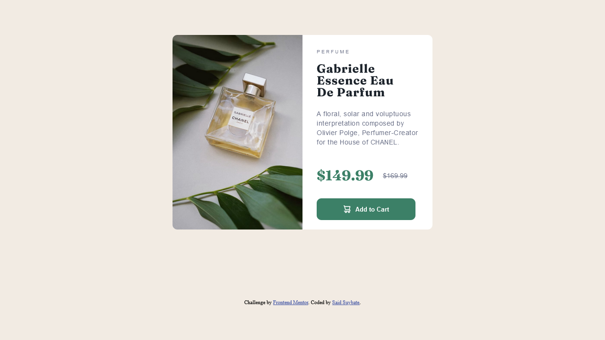

# Frontend Mentor - Product preview card component solution

This is a solution to the [Product preview card component challenge on Frontend Mentor](https://www.frontendmentor.io/challenges/product-preview-card-component-GO7UmttRfa). Frontend Mentor challenges help you improve your coding skills by building realistic projects. 

## Table of contents

- [Overview](#overview)
  - [The challenge](#the-challenge)
  - [Screenshot](#screenshot)
  - [Links](#links)
- [My process](#my-process)
  - [Built with](#built-with)
  - [Continued development](#continued-development)
- [Author](#author)

**Note: Delete this note and update the table of contents based on what sections you keep.**

## Overview

### The challenge

Users should be able to:

- View the optimal layout depending on their device's screen size
- See hover and focus states for interactive elements

### Screenshot

### Links

- Solution URL: [Github repository](https://github.com/SaidSuyv/product_preview_card_component)
- Live Site URL: [Online Page](https://saidsuyv.github.io/product_preview_card_component/)

## My process
### Built with

- Semantic HTML5 markup
- CSS custom properties
- Flexbox
- CSS Grid
- Mobile-first workflow

### Continued development

I would totally like to perfect the use of Grid in CSS, it was quite difficult for me to use it and I needed to look for some things. Also maybe trying to improve my CSS skills for a better performance.

## Author

- Website - [My portfolio](https://said.github.io/Portfolio)
- Frontend Mentor - [@SaidSuyv](https://www.frontendmentor.io/profile/yourusername)
